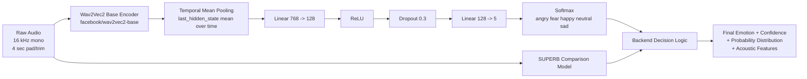

# Model Documentation - Kannada Speech Emotion Recognition

## 1. Scope

This document describes the model system used in the Kannada Speech Emotion Recognition project, including:
- Core Kannada model architecture
- Comparison model (SUPERB) behavior
- Inference and decision pipeline
- Metrics currently exposed by the backend
- Data and feature flow
- Operational behavior and known limitations

## 2. Emotion Taxonomy

The application predicts five final classes:
- angry
- fear
- happy
- neutral
- sad

## 3. Model Stack

### 3.1 Primary Model (Kannada Model)

Implementation path:
- backend/ml/predictor.py

Artifacts:
- models/emotion_model.pt (fine-tuned classification head + compatible state)
- models/processor (Wav2Vec2 processor)
- models/wav2vec2_base (Wav2Vec2 backbone files)

Backbone:
- facebook/wav2vec2-base

Classifier head (in code):
- Linear(768 -> 128)
- ReLU
- Dropout(0.3)
- Linear(128 -> 5)

Runtime properties:
- Target sample rate: 16000 Hz
- Max modeled duration: 4.0 seconds (padded/truncated)
- Inference device: CUDA if available, else CPU

Label index map used in inference:
- 0 -> angry
- 1 -> fear
- 2 -> happy
- 3 -> neutral
- 4 -> sad

### 3.1.1 Model Architecture (Detailed)

Input layer:
- Raw mono waveform at 16 kHz
- Audio padded/truncated to 4 seconds (64,000 samples)

Backbone encoder:
- Pretrained Wav2Vec2 base encoder
- Model: facebook/wav2vec2-base
- Produces contextual hidden representations over time

Temporal pooling:
- Mean pooling across time dimension of last hidden state
- Converts sequence output to one fixed-length vector

Classification head:
- Linear: 768 -> 128
- ReLU
- Dropout: 0.3
- Linear: 128 -> 5 classes

Output:
- Softmax over 5 emotions: angry, fear, happy, neutral, sad

Runtime decision layer (pipeline level):
- Kannada model runs in parallel with SUPERB comparison model
- Final emotion is resolved via backend decision logic (including sad/fear override)
- UI shows class probabilities and extracted acoustic features

### 3.2 Comparison Model (SUPERB)

Implementation path:
- backend/ml/openai_analyzer.py

Model id:
- superb/wav2vec2-base-superb-er

Purpose:
- Cross-check / comparison signal in prediction pipeline

Important behavior:
- SUPERB ER effectively behaves as a 4-emotion space (angry, happy/excited, neutral, sad)
- Fear is not a strong native output in many samples, so fear can be low or absent from its probability distribution

## 4. One-Time Local Bootstrap

Primary model bootstrap in backend/ml/predictor.py:
- On first run, processor and backbone are downloaded and saved locally:
  - models/processor
  - models/wav2vec2_base
- After bootstrap, loading is local-only via local_files_only=True

Implication:
- Internet is needed only for the first successful bootstrap
- Subsequent runs load entirely from local model artifacts

## 5. Inference Pipeline (Primary Model)

1. Audio load:
- torchaudio.load first
- librosa fallback for unsupported containers

2. Normalization:
- Resample to 16000 Hz if required
- Convert to mono

3. Silence handling:
- librosa.effects.trim(top_db=25)
- Reject if near-silence or too short (< 0.5 s effective)

4. Model input shaping:
- Keep trimmed audio for feature reporting
- Pad/truncate model input to 4 sec

5. Tokenization:
- Wav2Vec2Processor -> input_values + attention_mask

6. Inference:
- Forward pass through Wav2Vec2 + classifier head
- Softmax probabilities

7. Output:
- emotion (argmax)
- confidence (top softmax percentage)
- full class probabilities
- acoustic feature summary

## 6. Acoustic Feature Extraction (for UI/analysis)

Computed in backend/ml/predictor.py:
- MFCC mean (13 coefficients aggregated)
- Pitch (pyin C2 to C7)
- RMS energy
- Intensity (dB from amplitude_to_db on energy)
- Zero Crossing Rate
- Duration

Note:
- These features are exposed to UI and analytics; main classification is driven by Wav2Vec2 waveform representation.

## 7. Route-Level Decision Pipeline

Implementation path:
- backend/routes/predict.py

Current server flow for live/upload prediction:
1. Receive and validate audio file
2. Convert non-WAV formats to 16 kHz mono WAV if needed
3. Upload file to Cloudinary
4. Run two analyses in parallel:
   - Kannada model (primary local model)
   - SUPERB comparison model
5. Build final response and persist prediction in MongoDB

### 7.1 Sad/Fear Override Rule

Current rule in backend/routes/predict.py:
- If SUPERB final emotion is sad:
  - Read Kannada model fear confidence
  - Always expose this Kannada fear value in returned Fear probability row
  - If Kannada fear confidence >= 8.0, override final emotion to fear

This keeps decision logic thresholded while ensuring Fear row is not incorrectly shown as 0 when Kannada fear signal exists.

## 8. Metrics and Reported Performance

Backend stats endpoint:
- backend/routes/stats.py -> GET /api/stats/performance

Current default metrics used when persisted metrics are unavailable:
- Accuracy: 84.00
- Precision: 84.91
- Recall: 84.00
- F1 Score: 84.19

Model type label returned by API:
- Wav2Vec2 (Raw Waveform)

Notes:
- If model info pickle exists and contains values, those values are used.
- Otherwise the defaults above are returned.

## 9. Dataset Notes in Current System

Stats route canonical emotions for dataset reporting:
- anger
- fear
- happiness
- neutral
- sadness

Dataset statistics can come from:
- Split manifests (preferred)
- Folder scan fallback (processed_audio / dataset)

## 10. API Output Shape (Prediction)

Prediction response includes:
- id
- emotion
- confidence
- probabilities
- acoustic_features
- cloudinary_url
- audio_file
- duration
- source
- analysis
- timestamp

Protected endpoints require JWT Bearer authentication.

## 11. Known Constraints

- Super short or near-silent audio is rejected
- Fear can be under-represented by SUPERB-only distributions
- Quality depends on microphone, noise level, and speaking clarity
- Language mismatch or non-speech audio can degrade confidence quality

## 12. Validation Checklist for Model Behavior

Use this checklist after model updates:
- Primary model loads without warning from local artifacts
- First-run bootstrap works on a clean machine
- /api/predict/live returns all 5 classes in probabilities
- Sad/Fear override triggers only when fear >= 8
- Fear row reflects Kannada fear value when SUPERB says sad
- /api/stats/performance returns expected metrics and model type

## 13. Future Improvements

Suggested model improvements:
- Persist and version model metadata with explicit training commit hash
- Log calibration metrics (ECE/Brier) for confidence reliability
- Add per-class precision/recall/F1 in API output
- Add confusion matrix versioning per deployed model
- Add fallback/noise-class handling for non-speech inputs
