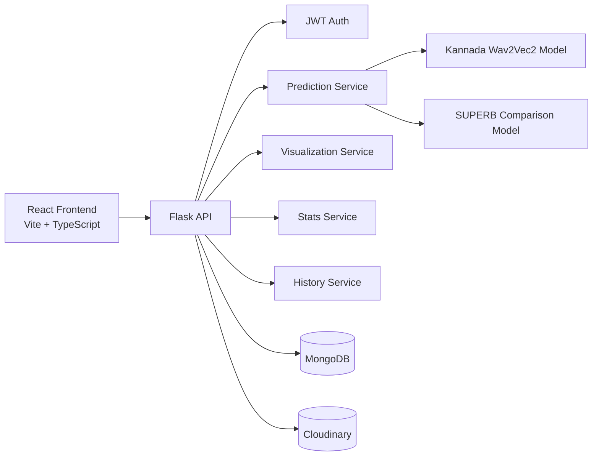

# Kannada Speech Emotion Recognition (Kannada SER)

Production-style full-stack platform for detecting emotions from Kannada speech audio.

This project includes:
- A modern React frontend for live detection, uploads, analytics, and visualization
- A Flask backend for authentication, model inference, history, stats, and signal extraction
- A local Wav2Vec2-based Kannada model
- A SUPERB comparison model for cross-check logic
- MongoDB persistence and Cloudinary media storage

## Quick Start Files

- New machine onboarding: [SETUP.md](SETUP.md)
- One-command launcher (Windows PowerShell): [start_project.ps1](start_project.ps1)

## 1. Executive Summary

The system classifies Kannada speech into five emotion labels:
- angry
- fear
- happy
- neutral
- sad

It supports both microphone-based live detection and file uploads, logs prediction history per user, provides model/dataset dashboards, and exposes an audio-visualization endpoint that extracts real signal features.

## 2. System Architecture



## 3. Repository Layout

```text
kannada speech recog/
  backend/
    app.py
    config.py
    database.py
    requirements.txt
    ml/
      predictor.py           # main Kannada model inference
      openai_analyzer.py     # local SUPERB comparison model
    routes/
      auth.py
      predict.py
      history.py
      stats.py
      visualization.py

  frontend/
    package.json
    src/
      api/
      components/
      contexts/
      pages/
      router/

  models/
    emotion_model.pt
    processor/
    wav2vec2_base/
```

## 4. Core Functional Modules

### 4.1 Authentication
- Register / login / profile endpoints
- JWT-based route protection
- User-scoped prediction history

### 4.2 Prediction Pipeline
- Accepts upload and live-audio input
- Converts to 16 kHz mono WAV when needed
- Runs Kannada model and SUPERB model in parallel
- Applies override rule for sad/fear decision path
- Stores result in MongoDB and audio in Cloudinary

### 4.3 Visualization Pipeline
- Extracts real-time signal metrics from uploaded audio
- Provides:
  - waveform
  - pitch (pyin)
  - MFCC (13 coefficients)
  - frequency spectrum (magnitude + phase)
  - RMS energy
  - zero crossing rate

### 4.4 Analytics
- Dashboard-level usage and emotion distribution
- Dataset stats from manifests or directory fallback scan
- Model-performance metrics endpoint

## 5. Runtime Model Details

### Main Kannada Model
- Inference file: backend/ml/predictor.py
- Weights file: models/emotion_model.pt
- Backbone: facebook/wav2vec2-base

### One-Time Bootstrap Download
On first backend run, predictor downloads and stores local assets:
- models/processor
- models/wav2vec2_base

Subsequent runs load local files only.

### Comparison Model
- Model: superb/wav2vec2-base-superb-er
- Used as cross-check in live/upload inference flow

## 6. Environment and Prerequisites

Required:
- Python 3.10+
- Node.js 18+
- MongoDB (local or cloud)
- FFmpeg (recommended for robust format conversion)

Recommended OS setup:
- Windows PowerShell (project currently tuned for Windows dev workflow)

## 7. Backend Setup

### 7.1 Create virtual environment

```powershell
cd backend
python -m venv .venv
.\.venv\Scripts\Activate.ps1
```

### 7.2 Install dependencies

```powershell
pip install -r requirements.txt
```

### 7.3 Configure environment variables

Create file: backend/.env

```env
MONGO_URI=mongodb://localhost:27017
MONGO_DB=kannada_ser

JWT_SECRET=change-me-in-production
JWT_EXPIRY_DAYS=7

CLOUDINARY_CLOUD_NAME=
CLOUDINARY_API_KEY=
CLOUDINARY_API_SECRET=

DEBUG=true
PORT=5000
FRONTEND_ORIGIN=http://localhost:5173

INFERENCE_MODE=wav2vec2
HF_API_TOKEN=
```

### 7.4 Run backend

```powershell
cd backend
python app.py
```

Health endpoint:

```text
GET http://127.0.0.1:5000/api/health
```

## 8. Frontend Setup

### 8.1 Install dependencies

```powershell
cd frontend
npm install
```

### 8.2 Configure API base URL (optional)

Create file: frontend/.env

```env
VITE_API_URL=http://localhost:5000
```

### 8.3 Run frontend

```powershell
cd frontend
npm run dev
```

Default URL:

```text
http://localhost:5173
```

## 9. API Reference

### 9.1 Auth APIs

| Method | Endpoint | Description |
|---|---|---|
| POST | /api/auth/register | Create user account |
| POST | /api/auth/login | Login and receive JWT |
| GET | /api/auth/me | Get current user profile |

### 9.2 Prediction APIs

| Method | Endpoint | Description |
|---|---|---|
| POST | /api/predict/upload | Upload audio and predict emotion |
| POST | /api/predict/live | Send live audio chunk and predict emotion |

### 9.3 History APIs

| Method | Endpoint | Description |
|---|---|---|
| GET | /api/predictions | List user predictions |
| DELETE | /api/predictions | Delete all user predictions |
| DELETE | /api/predictions/:id | Delete one prediction |

### 9.4 Stats APIs

| Method | Endpoint | Description |
|---|---|---|
| GET | /api/stats/dashboard | User dashboard stats |
| GET | /api/stats/performance | Model metrics |
| GET | /api/stats/dataset | Dataset summary |

### 9.5 Visualization API

| Method | Endpoint | Description |
|---|---|---|
| POST | /api/visualization/extract | Extract waveform/pitch/MFCC/FFT/energy/ZCR |

### 9.6 Authorization Header

Protected endpoints require:

```text
Authorization: Bearer <token>
```

## 10. Audio Input Support

Accepted formats:
- wav
- mp3
- ogg
- flac
- m4a
- webm

Normalization flow:
- Non-WAV input is converted to mono 16 kHz WAV for consistent inference.

## 11. Frontend Scripts

From frontend:

```powershell
npm run dev
npm run build
npm run preview
npm run lint
npm run type-check
```

## 12. Operational Notes

- app.py starts with use_reloader disabled to reduce Windows socket reload issues.
- First model warm-up may take longer due to local bootstrap downloads.
- Cloudinary is required for persistent audio URLs in history.

## 13. Troubleshooting Guide

### Backend fails to start
- Ensure you run from backend directory.
- Ensure active venv matches installed dependencies.
- Validate .env keys (MongoDB URI, Cloudinary keys).
- Confirm emotion_model.pt exists in models directory.

### Model initialization warning
- First run can be slow while downloading processor/backbone.
- Ensure internet is available for first bootstrap.
- Subsequent runs should be local-only.

### API returns 401
- Confirm login success and token storage.
- Verify Authorization header format.

### Audio conversion fails
- Install FFmpeg and confirm executable is discoverable.
- Retry with wav input to isolate conversion chain.

### Prediction history missing audio URL
- Verify Cloudinary credentials and upload success logs.

## 14. Security Checklist (Recommended)

- Replace default JWT secret before deployment.
- Store secrets only in environment variables.
- Enable HTTPS in production.
- Restrict CORS origin to deployed frontend URL.
- Rotate Cloudinary and DB credentials periodically.

## 15. Deployment Readiness Checklist

- Production .env values configured
- MongoDB production cluster connected
- Cloudinary production account configured
- Frontend VITE_API_URL set to deployed backend URL
- Health endpoint verified
- Basic prediction smoke test completed

## 16. License

This repository currently has no explicit OSS license file.
Add LICENSE before open-source distribution.
